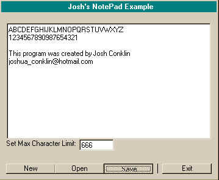



## A Simple notepad with options such as character limitation, new, open and save\!

### Description

This demonstrates some use of the common dialog and richttext box control. It is simple and i thoguht it wouldnt require comments. Enjoy!
 
### More Info
 
Oh one problem...You might need the common dialog control version 6.0 as well as the rich text box version 6.0, sorry for any inconveinces.. the code would work the same for both =)

             |
---                |---
**Submitted On**   |2001-04-11 17:03:46
**By**             |[Joshua Conklin](https://github.com/Planet-Source-Code/PSCIndex/blob/master/ByAuthor/joshua-conklin.md)
**Level**          |Beginner
**User Rating**    |4.4 (22 globes from 5 users)
**Compatibility**  |VB 5\.0
**Category**       |[Files/ File Controls/ Input/ Output](https://github.com/Planet-Source-Code/PSCIndex/blob/master/ByCategory/files-file-controls-input-output__1-3.md)
**World**          |[Visual Basic](https://github.com/Planet-Source-Code/PSCIndex/blob/master/ByWorld/visual-basic.md)
**Archive File**   |[A Simple n25861932001\.zip](https://github.com/Planet-Source-Code/joshua-conklin-a-simple-notepad-with-options-such-as-character-limitation-new-open-and-sav__1-26947/archive/master.zip)

